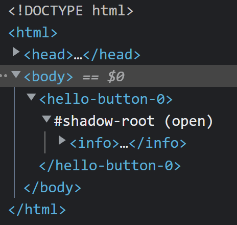

## Step 2: Creating a button
As you followed the getting started in the [README](../../README.md), you got
the first output.

Let's take a look into the component inspector (I'm using Chrome):    
     
As you can see, we got already a `shadow-root` for our component. So you don't need
to care about the creation. 

As the `info` describe, we can now create the button within the `render`function:
```tsx
import Component from '@enbock/ts-jsx/Component';
import {ShadowDomElement} from '@enbock/ts-jsx/ShadowDom';

export default class HelloButton extends Component {
    public render(): ShadowDomElement | ShadowDomElement[] {
        return <button>Click me</button>;
    }
}
```

### Temporarily bind the click handler
To get the first reaction, we add a most as simple click event handling:
```tsx
return <button onClick={() => alert('Hello')}>Click me</button>;
```
**Be aware!**    
An anonymous function binding lead into multiple event bindings. The
browser need a defined callback binding to detect already existing connections.

So here our result of this step:
```tsx
export default class HelloButton extends Component {
    private boundedHello: () => void = this.sayHello.bind(this);

    public render(): ShadowDomElement | ShadowDomElement[] {
        return <button onClick={this.boundedHello}>Click me</button>;
    }

    private sayHello(): void {
        alert('Hello');
    }
}
```
